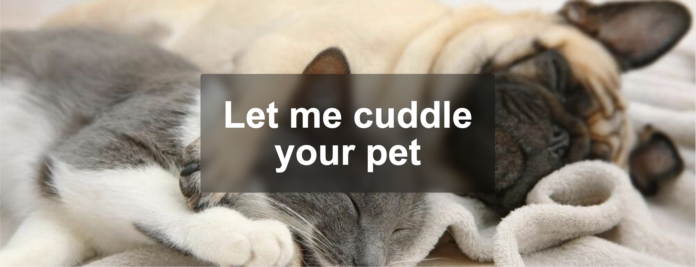
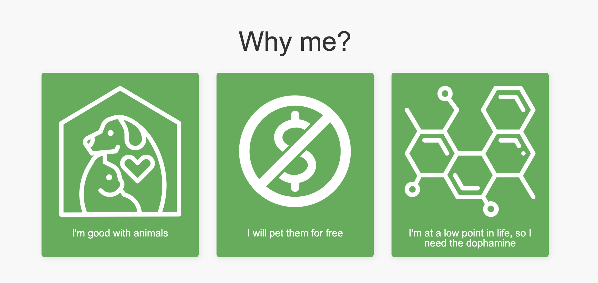
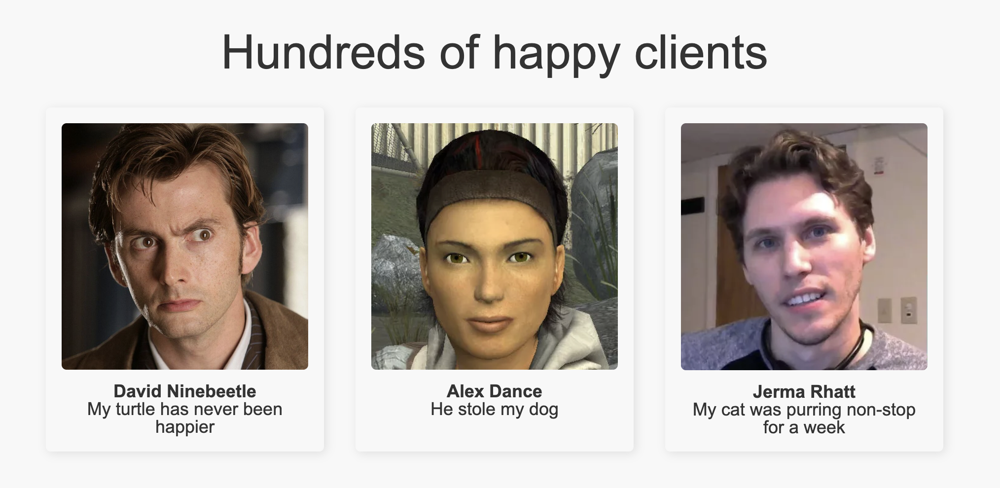
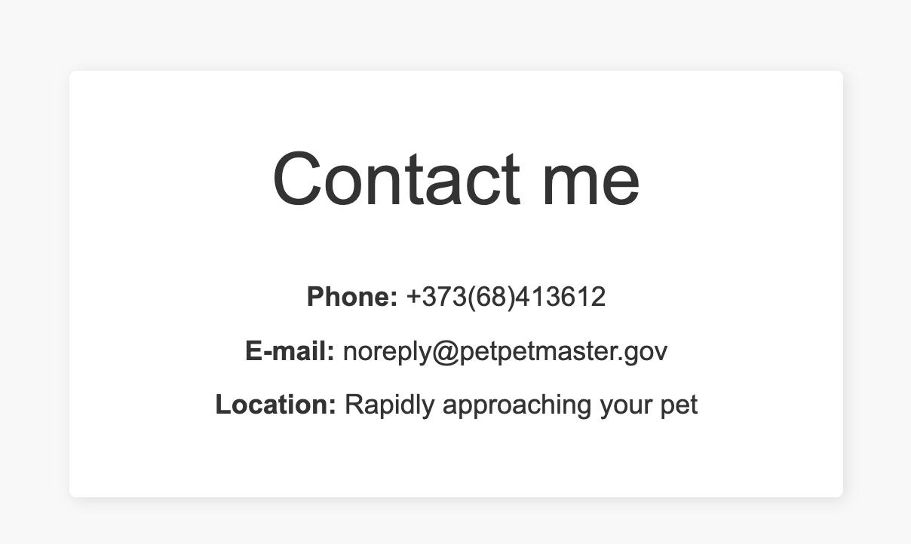

# PetPetMaster Landing Page

PetPetMaster is a lighthearted and fun website dedicated to one simple mission: cuddling your pets! Whether it's a dog, cat, or even a turtle, the goal is to shower them with affection, completely free of charge.

## Sections

- Hero Section – An eye-catcher for the site.
- Value Proposition – Why I'm the perfect choice to pet your animals.
- Call to Action – Invitation to contact me.
- Reviews – Glowing reviews from past clients.
- Contacts – Ways to get in touch.

## Screenshots
Here are some screenshots of the landing page:

### Hero Section

### Value Proposition

### Call to Action

### Reviews

### Contacts

## Live Demo
Check out the live demo of the landing page: [Live Demo](https://niksays.github.io/tum-web-lab2/) 

## Attributions
- Icons from Flaticon.com
- Photos of Jerma985, David Tennant, Alyx Vance